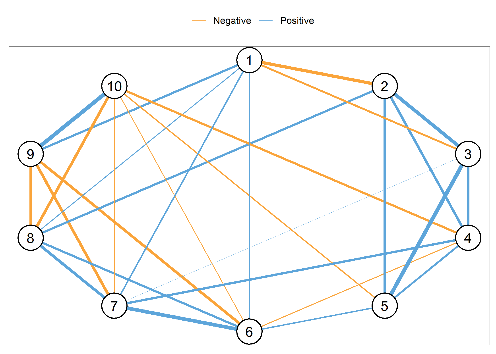

<!-- README.md is generated from README.Rmd. Please edit that file -->

# glaxo

<!-- badges: start -->


[](https://circleci.com/gh/josue-rodriguez/glaxo)
<!-- badges: end -->

The glaxo package provides an implementation of the relaxed lasso for
Gaussian graphical models based on the simple algorithm described in
section 2.2 of Meinshausen (2007). Because the classical lasso
introduces bias into the parameters, the motivation behind the relaxed
lasso is to *debias* the estimates.

## Installation

You can install the released version of glaxo from
[CRAN](https://CRAN.R-project.org) with:

``` r
install.packages("glaxo")
```

And the development version from [GitHub](https://github.com/) with:

``` r
# install.packages("devtools")
devtools::install_github("josue-rodriguez/glaxo")
```

## Example

The main function in this package is called `glaxo` (relaxed + glasso).
In it’s most basic form, it takes a `data.frame` or `matrix` and
estimates the relaxed lasso solution for the graphical model

``` r
library(glaxo)

Y <- psych::bfi[, 1:10]
Y <- na.omit(Y)

relaxed_glasso <- glaxo(Y, progress = FALSE)
```

``` r
relaxed_glasso
#>         1      2      3      4      5      6      7      8      9     10
#> 1   0.000 -0.249 -0.109  0.000  0.000  0.043  0.068  0.037  0.110  0.000
#> 2  -0.249  0.000  0.285  0.159  0.149  0.000  0.000  0.121  0.000  0.021
#> 3  -0.109  0.285  0.000  0.169  0.357  0.000  0.014  0.000  0.000  0.000
#> 4   0.000  0.159  0.169  0.000  0.107 -0.036  0.142 -0.015  0.000 -0.140
#> 5   0.000  0.149  0.357  0.107  0.000  0.056  0.000  0.000  0.000 -0.051
#> 6   0.043  0.000  0.000 -0.036  0.056  0.000  0.301  0.129 -0.160 -0.030
#> 7   0.068  0.000  0.014  0.142  0.000  0.301  0.000  0.183 -0.187 -0.042
#> 8   0.037  0.121  0.000 -0.015  0.000  0.129  0.183  0.000 -0.122 -0.177
#> 9   0.110  0.000  0.000  0.000  0.000 -0.160 -0.187 -0.122  0.000  0.357
#> 10  0.000  0.021  0.000 -0.140 -0.051 -0.030 -0.042 -0.177  0.357  0.000
```

The resulting object can also be plotted using standard `ggplot2` syntax

``` r
library(ggnetwork)

plot_edges(relaxed_glasso, layout = "circle") +
  scale_size(range = c(0,2)) +
  guides(size = FALSE) +
  scale_color_manual(values = c("#FAA43A", "#5DA5DA"),
                     name = "",
                     labels = c("Negative", "Positive")) +
  theme_facet() +
  theme(legend.position = "top")
```



Predictions can be made on new data using the relationship between
Gaussian graphical models and linear regression (e.g., Stevens 1998)

``` r
preds <- predict(relaxed_glasso, newdata = Y[1001:2000, ])
str(preds)
#> List of 2
#>  $ predictions: num [1:1000, 1:10] 1.83 2 2.98 3.04 3.03 ...
#>  $ beta_matrix: num [1:10, 1:10] 8.54e-01 -2.18e-01 -9.25e-02 3.67e-07 8.84e-07 ...
round(head(preds$predictions), 3)
#>       [,1]  [,2]  [,3]  [,4]  [,5]  [,6]  [,7]  [,8]  [,9] [,10]
#> [1,] 1.831 5.495 5.232 5.101 5.213 3.887 3.492 3.674 3.230 4.109
#> [2,] 2.002 4.800 5.051 5.183 5.144 5.263 5.708 5.096 2.161 2.007
#> [3,] 2.981 4.088 4.235 4.035 4.196 3.615 3.898 3.657 3.532 4.946
#> [4,] 3.038 2.759 2.785 3.575 2.869 4.419 4.057 4.357 2.337 3.737
#> [5,] 3.033 4.318 4.221 3.794 3.493 5.090 4.987 4.300 2.637 2.204
#> [6,] 2.663 4.380 4.539 4.742 4.491 4.406 3.940 3.905 3.241 4.554
round(preds$beta_matrix, 3)
#>         [,1]   [,2]   [,3]   [,4]   [,5]   [,6]   [,7]   [,8]   [,9]  [,10]
#>  [1,]  0.854 -0.283 -0.129  0.000  0.000  0.046  0.076  0.039  0.125  0.000
#>  [2,] -0.218  0.657  0.294  0.146  0.145  0.000  0.000  0.113  0.000  0.020
#>  [3,] -0.093  0.276  0.615  0.151  0.335  0.000  0.013  0.000  0.000  0.000
#>  [4,]  0.000  0.172  0.189  0.773  0.113 -0.037  0.150 -0.015  0.000 -0.147
#>  [5,]  0.000  0.154  0.381  0.102  0.701  0.054  0.000  0.000  0.000 -0.051
#>  [6,]  0.041  0.000  0.000 -0.036  0.058  0.751  0.314  0.129 -0.170 -0.031
#>  [7,]  0.061  0.000  0.015  0.134  0.000  0.289  0.690  0.174 -0.191 -0.041
#>  [8,]  0.035  0.130  0.000 -0.015  0.000  0.130  0.192  0.758 -0.130 -0.183
#>  [9,]  0.097  0.000  0.000  0.000  0.000 -0.149 -0.183 -0.113  0.659  0.345
#> [10,]  0.000  0.022  0.000 -0.134 -0.051 -0.029 -0.042 -0.170  0.369  0.705
```

# Relaxed lasso vs regular lasso

The intuition behind the relaxed lasso is that the lasso algorithm is
run on the data once for an initial screening and then again to lower
the false positive rate (i.e., 1 - specificity). This can result in
better performance than the traditional lasso solution

``` r
library(GGMncv)

main <- GGMnonreg::gen_net()
n <- 5000
Y <- MASS::mvrnorm(n, mu = rep(0, 20), main$cors)

regular_glasso <- GGMncv::ggmncv(cor(Y),
                                 n = nrow(Y), 
                                 penalty = "lasso", 
                                 ic = "bic",
                                 progress = FALSE)

relaxed_glasso <- glaxo(Y, progress = FALSE, ic = "bic")


glaxo:::performance(Estimate = regular_glasso$adj, True = main$adj)
#>       measure     score
#> 1 Specificity 0.3984962
#> 2 Sensitivity 1.0000000
#> 3   Precision 0.4160584
#> 4      Recall 1.0000000
#> 5    F1_score 0.5876289
#> 6         MCC 0.4071826
glaxo:::performance(Estimate = relaxed_glasso$adj, True = main$adj)
#>       measure     score
#> 1 Specificity 0.9248120
#> 2 Sensitivity 1.0000000
#> 3   Precision 0.8507463
#> 4      Recall 1.0000000
#> 5    F1_score 0.9193548
#> 6         MCC 0.8870064
```

# References

<div id="refs" class="references csl-bib-body hanging-indent">

<div id="ref-meinshausen2007relaxed" class="csl-entry">

Meinshausen, Nicolai. 2007. “Relaxed Lasso.” *Computational Statistics &
Data Analysis* 52 (1): 374–93.

</div>

<div id="ref-stevens1998inverse" class="csl-entry">

Stevens, Guy VG. 1998. “On the Inverse of the Covariance Matrix in
Portfolio Analysis.” *The Journal of Finance* 53 (5): 1821–27.

</div>

</div>
